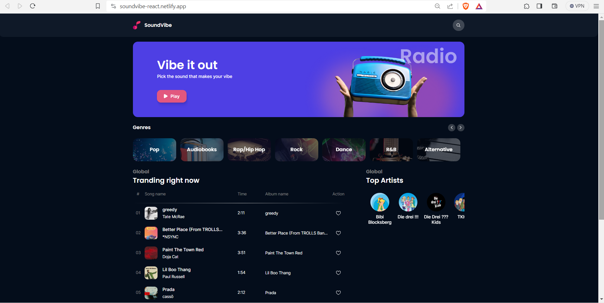

**_Live demo : https://soundvibe-react.netlify.app/_**

# Sound Vibe

SoundVibe is a modern React application that has been built in collaboration with ZackAcademy. This project serves as a web interface for playing and previewing the top songs from musical charts. It enables users to search for tracks in different languages, from artists around the globe, and provides a live radio stream. The application is also equipped with a classification system for different songs in different musical categories, and a dedicated interface for each artist's songs. Additionally, users can mark their favorite tracks and use the custom player on any device.

# Technical objectives

The project is built on a component-based architecture that follows a modular folder structure for file management. The source of data is the 'https://www.deezer.com/en/' API that provides complete details about trending songs and artists. React Router has been used to implement specific pages for each section of the web app, and error pages have been added for edge cases.

The components in this project are made using styled-components, and each individual component has its own set of styles suitable for different screen devices. The Context API of React has been used to manage the state globally and keep track of songs. The list of tracks is controlled with the help of reducer functions.

The browser's local storage has been employed to keep track of favorite songs and make them easily accessible on each visit. The React Skeleton has been configured responsively for each individual component, providing a smooth loading layer before the data is fetched. React Error Boundary was also used to prevent the app from crashing and to provide a better user experience. Toast has been configured to provide meaningful messages on each occasion on the client's side.

## Installation

- Make sure you have Node (v20.8.1 has been used on this project) installed on your system or download it from https://nodejs.org/en.

- Clone this repository or download the zip file .
- Open the terminal on the same directory and run the following commands to install the dependencies and run the project .

```
yarn install
yarn start
```

{ width: 200px; }
_Home page_ <br>
 { width: 200px; }
_Custom mobile player_ <br>
{ width: 200px; }
_Search Player_ <br>
