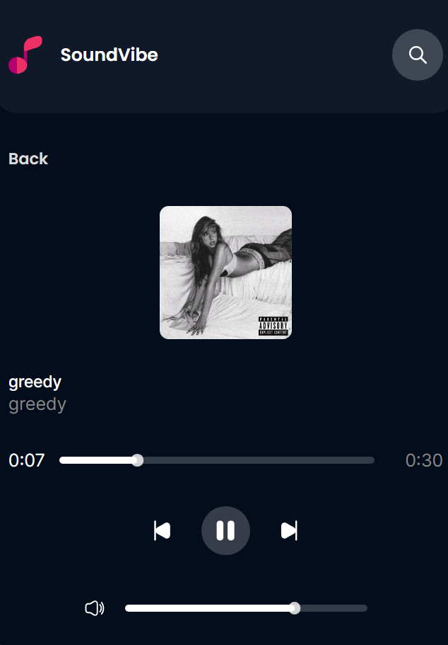

**_Live demo : https://soundvibe-react.netlify.app/_**

# Sound Vibe

So, I built this web app called SoundVibe. Basically, it's a place where you can easily find and listen to the hottest songs from music charts. You can search for tracks in different languages, check out artists from all over the world, and even tune into a live radio stream.  I also added a feature that sorts songs into different genres, and each artist gets their own page so you can see all their stuff. Oh, and you can save your favorite songs and listen to them on any device with the custom player."

Under the Hood: How it Works

"Technically, the whole project is built using a component-based approach, which just means I broke it down into smaller, manageable pieces. Everything's organized in a modular folder structure, so it's easy to find stuff.  The data comes from the Deezer API, which has all the details on trending songs and artists.  I used React Router to create separate pages for each section of the site, and I made sure to include error pages for those 'oops' moments.

For the look and feel, I used styled-components, so each part of the site has its own unique style that works well on different screen sizes.  To manage the music state, I used React's Context API, which makes it easy to keep track of what's playing.  The actual list of songs is handled with reducer functions.

To remember your favorite songs, I used the browser's local storage, so they're always there when you come back.  And to make the loading experience smooth, I implemented React Skeleton, which shows a placeholder while the data is loading.  I also added React Error Boundary to catch any errors and prevent the app from crashing, and Toast notifications to give users helpful messages along the way.

## Installation

- Make sure you have Node (v20.8.1 has been used on this project) installed on your system or download it from https://nodejs.org/en.

- Clone this repository or download the zip file .
- Open the terminal on the same directory and run the following commands to install the dependencies and run the project .

```
yarn install
yarn start
```


  <sub>Home page</sub>   <br>

<sub>Custom mobile player</sub> <br>

<sub> Search Player</sub>
